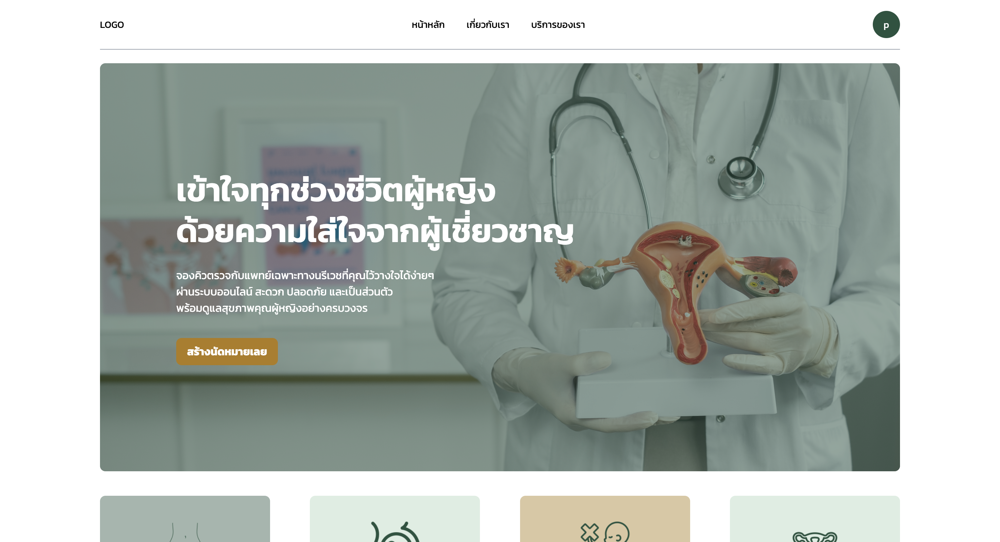
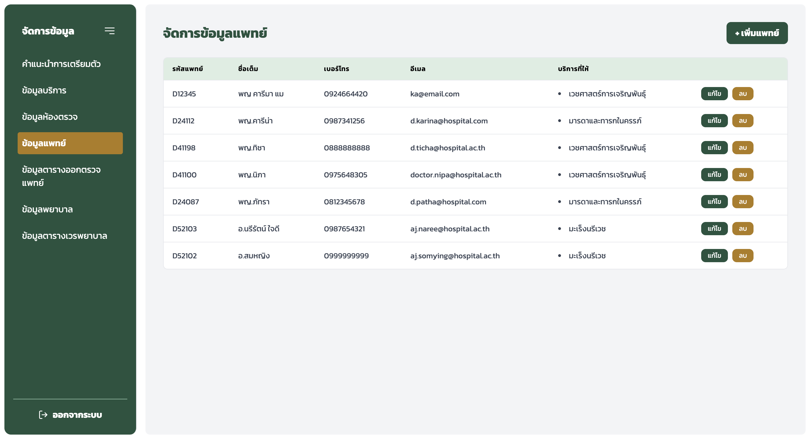
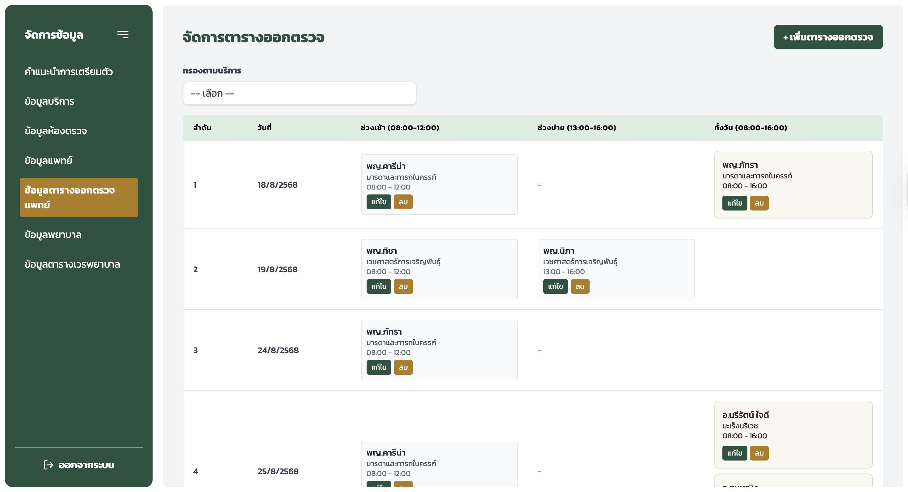
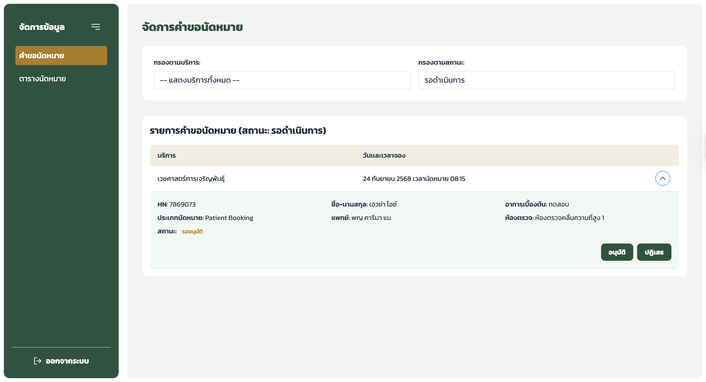
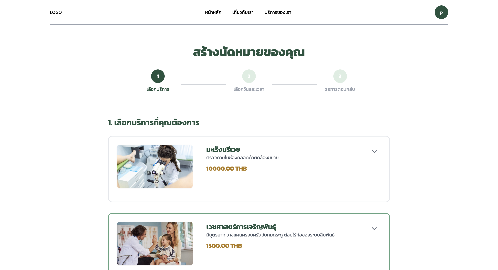
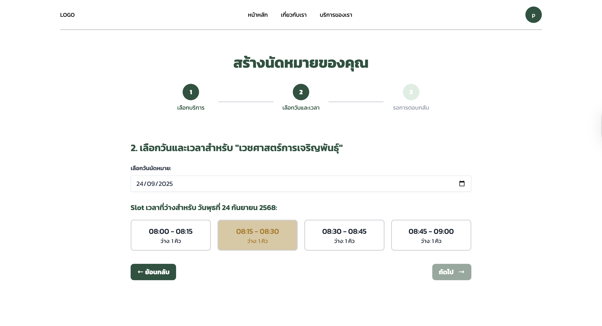
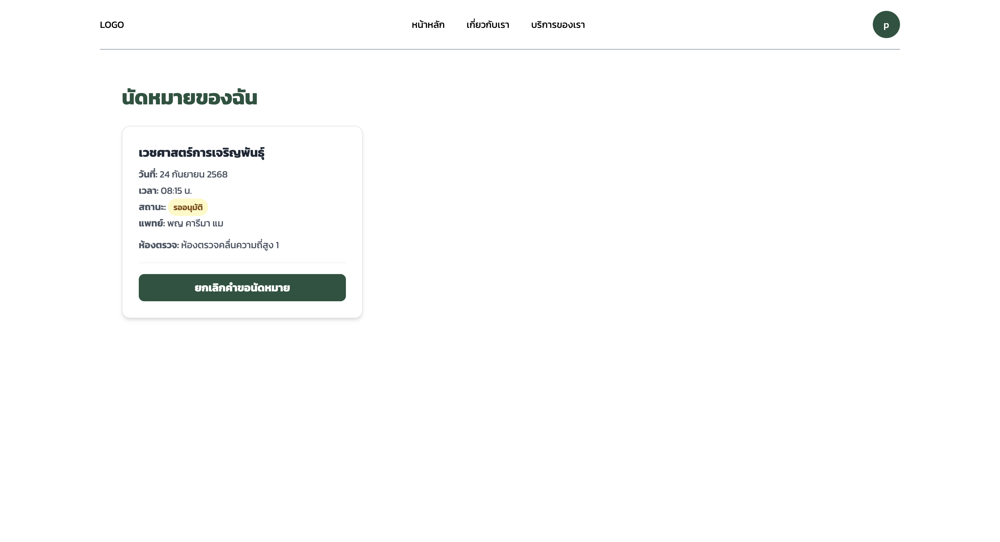

# 🏥 Online Patient Queue Management System (Senior Project)
The Clinic Booking System is a full-stack appointment management system developed with React.js (Frontend), Node.js/Express (Backend), MySQL (Database), and Docker Compose for easy setup and deployment.
The system supports 4 user roles: Head Nurse, Nurse, Doctor, and Patient.

---
## 📖 Project Background
Currently, Songklanagarind Vejvivat Hospital provides an online appointment system for patient convenience. However, the existing application does not fully meet user needs because most patients cannot assess which specialized service they should access, such as gynecology clinics. As a result, patients often prefer to book appointments by phone.
This phone-based method creates other issues, including delays, high call volumes for staff, and mismatched service selection by patients who are unsure of their symptoms. These problems can slow down treatment and affect overall clinic queue management.
This project aims to develop an online queue management system with an initial patient symptom assessment feature to help guide patients to the appropriate service. The system simplifies the booking process, improves patient convenience, reduces staff workload, and enhances clinic service efficiency and modernization in the digital era.

---
## 👥 User Roles & Features
### 1. Head Nurse
- Manage gynecology clinic services
- Manage doctor information
- Manage doctor schedules
- Manage nurse information
- Manage nurse duty schedules
- Manage patient symptom assessment forms
- View statistical reports

### 2. Nurse
- Handle patient appointment requests
- Prepare basic patient health information before consultation
- Monitor patient queue and call patients into examination rooms

### 3. Patient
- Book appointments online
- Complete symptom assessments to find suitable services
- Check available dates and times for booking
- Track appointment status
- Cancel appointments if needed
- View booking history

### 4. Doctor
- View patient basic information for diagnosis
- Record diagnosis results
- Schedule follow-up appointments
- Issue medical certificates

---
## 🛠️ Tech Stack
- **Frontend:** React.js, Tailwind CSS, Vite, Axios, React Router, React Toastify, Lucide React
- **Backend:** Node.js, Express, JWT, bcrypt, MySQL2
- **Database:** MySQL 8.0
- **Database Management:** phpMyAdmin
- **Containerization:** Docker Compose

---

## 🚀 Installation & Running the Project

### 1. Clone the repository
```bash
git clone https://github.com/Nongkreem/clinic-app.git
cd clinic-app
```

### 2. Start MySQL and phpMyAdmin using Docker
```bash
docker-compose up -d
```
* Access phpMyAdmin at http://localhost:8080
* Username: root
* Password: rootpassword

### 3. Run Backend
```bash
cd backend
npm install
npm run dev
```

### 4. Run Frontend
```bash
cd frontend
npm install
npm run dev
```
* Frontend is accessible at http://localhost:5173
---
## 📸 Screenshots (Examples)
### Home page


### 1. Head Nurse View
#### Doctor Data Management System

#### Doctor Schedule Management System

### 2. Nurse View

### 3. Patient View
#### Create Appointment




---
## 💡 What I Learned
- Time management and task planning
- Designing a flexible and user-friendly system
- Analyzing real user requirements (interviewing nurses to understand pain points)
- Database design and full-stack integration
- Full-stack development (React + Node.js + MySQL)
- Docker & containerization for consistent service deployment
- State management with React Context API
- REST API design and authentication
- Responsive and user-friendly frontend design
